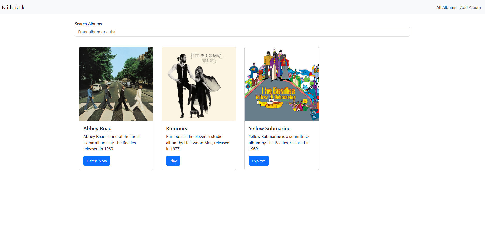
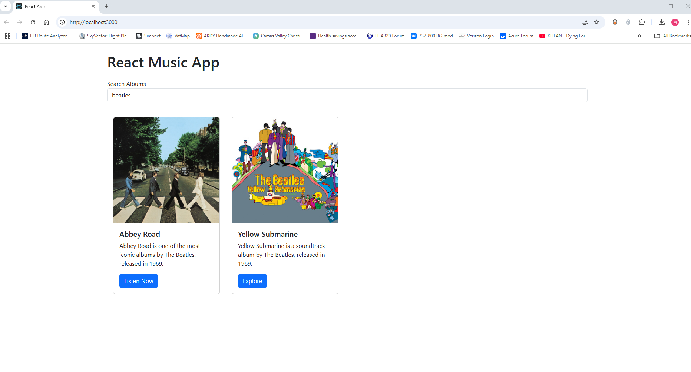
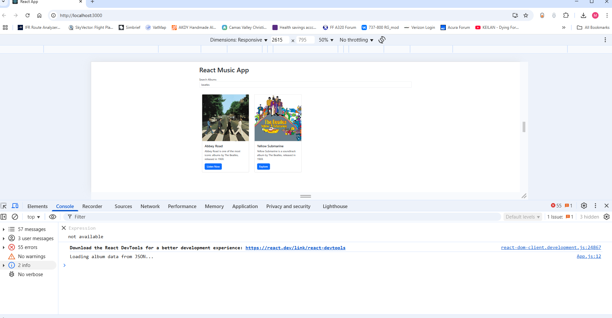
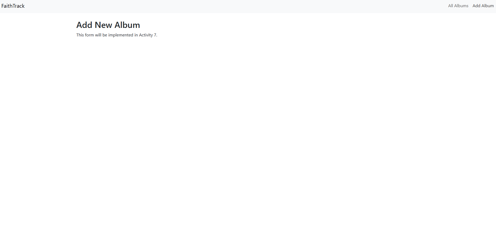

# CST-391: JavaScript Web Application Development  
## Activity 6: React Music App API Data  
**Matt Kollar**  
**April 11, 2025**

---

## 📦 Part 3 – External Data Source and API Integration

### 🔹 1. Initial JSON Integration
The static album list was removed from the `App.js` file and placed into an external `albums.json` file. The app was updated to use `useEffect` and `useState` to load data into the React state.

### 🔹 2. Search Form
A new component called `SearchForm.js` was added. It includes a controlled input field that triggers a callback to `App.js` when the form is submitted. The `App.js` component listens for search updates and filters the album list accordingly.

### 🔹 3. REST API with Axios
The static JSON file was replaced by an Express-based REST API. Axios was installed and used in a new helper module to fetch data from `http://localhost:3001/albums`. This updated the app to become dynamic and API-driven.

### 📸 Screenshots for Part 3

#### Final Homepage View  
**Filename**: `final-homepage.png`  
  
**Caption**: This screenshot shows the React Music App homepage rendering album cards from a live API using Axios.

---

#### Search Filter in Action  
**Filename**: `search-artist-or-album-example.png`  
  
**Caption**: Only albums containing the term "beatles" in their description are shown after a search.

---

#### Console Logging the Search  
**Filename**: `search-artist-or-album-console.png`  
  
**Caption**: Displays the React console log showing search activity and filtered results during use.

---

### 📝 Summary of Part 3
In Part 3, the album list was externalized to a JSON file and later served through a RESTful Express API. The app transitioned from a static frontend to a dynamic client consuming real backend data. Axios was introduced to handle the HTTP requests, and React's `useEffect` hook was used to control lifecycle-based data fetching. A search form was built using state and props to filter albums. This portion demonstrated how React components can respond to API data and user input interactively.

---

## 🚦 Part 4 – Navigation Routing and Component Refactoring

### 🔹 1. Component Refactor
The app was reorganized into reusable components:  
- `SearchAlbum`: Combines the search form and filtered list.  
- `AlbumList`: Renders a list of album `Card` components.  
- `Card`: Displays individual album data.

### 🔹 2. React Router Setup
`react-router-dom` was installed and used to define routes:
- `/` – main album list
- `/add` – new album placeholder
- `/show/:albumId` – stub route for album detail

A top `NavBar` was created with links using `<Link>` from React Router, allowing navigation without a page refresh.

### 📸 Screenshots for Part 4

#### Add Album Placeholder Page  
**Filename**: `add-new-album-placeholder.png`  
  
**Caption**: A placeholder route was created for adding new albums. This will be implemented in Activity 7.

---

### 📝 Summary of Part 4
In Part 4, the application was modularized into reusable components, improving structure and maintainability. React Router was introduced to handle client-side routing, enabling multiple views (homepage, add page, album detail) without reloading the browser. A NavBar was also added to enable seamless route switching. The app now resembles a complete single-page application (SPA) with real-time data, routing, and component reuse.

---
